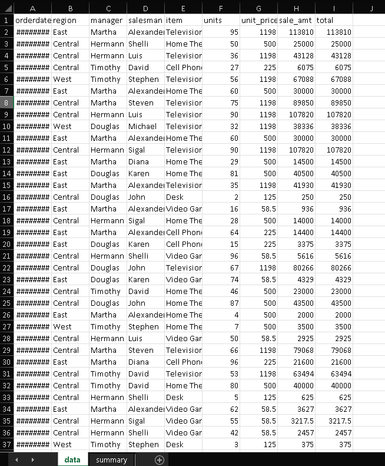

# Excel Data Pipeline

Automated Excel data pipeline built with Python and pandas.

This project processes multiple Excel files, cleans the data, automatically detects key columns, and generates a professional Excel report with summaries.

---

## Preview

Example workflow:

Input → Multiple raw Excel files
Output → Cleaned report with totals and summaries

---

## Features

* Combine multiple Excel files into one dataset
* Automatic column detection:

  * Quantity
  * Price
  * Product
* Data cleaning:

  * Remove duplicates
  * Handle missing values
* Automatic total sales calculation
* Summary by product
* Export professional Excel report with multiple sheets

---

## Tech Stack

* Python
* Pandas
* Openpyxl

---

## Project Structure

excel-data-pipeline/

data/ → Input Excel files
output/ → Generated reports
main.py → Main pipeline script
requirements.txt → Dependencies
.gitignore
README.md

---

## Installation

Clone the repository:

```bash
git clone https://github.com/beto-llanos/excel-data-pipeline.git
```

Enter the folder:

```bash
cd excel-data-pipeline
```

Install dependencies:

```bash
pip install -r requirements.txt
```

---

## Usage

Place your Excel files inside:

```
data/
```

Run the pipeline:

```bash
python main.py data
```

---

## Output

Generated file:

```
output/reporte_final.xlsx
```

Includes:

* Cleaned dataset
* Total sales column
* Summary by product

---

## Skills Demonstrated

This project demonstrates:

* Python scripting
* Data analysis with pandas
* Excel automation
* File handling
* Data pipeline development

---

## Author

Roberto Llanos

GitHub:
https://github.com/beto-llanos

---

## Why this project matters

This project reflects real-world data engineering tasks such as:

* Data cleaning
* Data transformation
* Automation
* Report generation

Common in business, finance, and analytics roles.

## Preview


